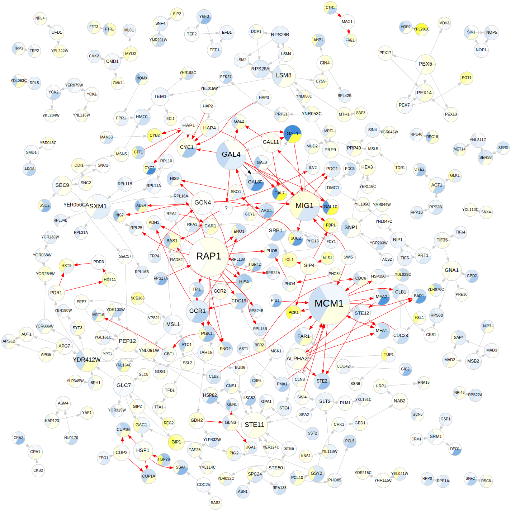

# Tabnetviz - table-based network visualizer

**Tabnetviz** generates network visualizations from node and edge
properties provided in tables. The node and edge properties can be
mapped to visual attributes in several ways. **Tabnetviz** was
inspired by the popular Cytoscape program which can also generate
similar mappings. However, Cytoscape is a resource-intensive,
interactive Java program with a complex graphical interface, and
loading networks from tables and defining mappings can be cumbersome
in it. **Tabnetviz**, on the other hand, is a non-interactive,
lightweight command-line tool guided by a single text-based
configuration file, thus ideal for use in scripts, Makefiles, and
reproducible workflows. Once a configuration file has been developed,
it only takes a single command to generate the network visualization
(typically an SVG file), and to quickly regenerate it whenever the
input data changes.

**Tabnetviz** generates static visualizations, and is applicable in a
wide range of fields such as bioinformatics (for gene regulatory
networks, protein interaction networks, etc.), neuroscience, and
studies of social networks, computer networks, economic networks, etc.

The **Tabnetviz** configuration file is a YAML format text file, which
is easily written manually, and easy to understand. It specifies the
node table and the edge table for the network (both can be CSV, TSV,
or Excel format files), and defines how to map the node and edge
properties (provided in node and edge table columns) to visual
attributes such as colors, node sizes, shapes, line widths, etc. Node
groups and edge groups can also be defined (using Boolean expressions
on the node/edge properties), and the mappings can be applied to them.

**Tabnetviz** is a Python program, and uses
[Graphviz](http://www.graphviz.org/) as its network visualization
back-end, and can use any node, edge, and graph attribute known to
Graphviz. It also uses Graphviz for generating network layouts.
Relying on the power of Graphviz, **Tabnetviz** can generate
high-quality images suitable as illustrations for science publications.

As a bonus, **Tabnetviz** can optionally calculate numerous graph
theoretical quantities such as degrees, centralities, clustering
coefficients, etc. These are added to the node/edge table, and can
then be mapped to visual attributes, e.g. node sizes or colors.

Here's an example visualization created by Tabnetviz:

## INSTALLATION

**Tabnetviz** uses Python 3.2+. Once you have Python installed, you
can install Tabnetviz by

`pip install tabnetviz`

(or `pip3` if you have separate "pip"s for Python 2 and 3).

Alternatively, you can download the source distribution from here
(github).

(Note that sometimes `pip` cannot install `pygraphviz` (required for
**tabnetviz**) correctly because of a compilation error. In this case,
you may try to install it in another way. On Debian Linux, use `apt
install python3-pygraphviz`, or `apt install libgraphviz-dev` before
using `pip`. See [this
discussion](https://github.com/pygraphviz/pygraphviz/issues/155) for
more details.)

## DOCUMENTATION

* [User Guide](docs/userguide.md)
* [Tutorial](docs/tutorial.md): a brief tutorial with introductory examples
* [Configuration File Reference](docs/configfile.md): full description
of configuration file options.
* [Demo visualization](docs/demo.md) of a complex network
* [Gallery](docs/gallery.md) of visualizations created with tabnetviz.

A configuration file template can also be output from the program
using the `--configtemplate` option; this can be used as a start for
writing a configuration file for your visualization.

## REQUIREMENTS

Tabnetviz uses Python 3.2+ and requires the following Python modules to
be installed: PyYAML, yamlloader, pygraphviz, pandas, matplotlib,
networkx, svgwrite.

## CREDITS

Program developed by [Andras Szilagyi](https://szialab.org). An
initial version of the network analyzer was programmed by Zsofia
Feher.

To cite **Tabnetviz**, you may use:

Szilagyi, Andras (2019): "Tabnetviz: a table-based network visualizer."
Application available at URL https://git.io/tabnetviz 

## LICENSE

**Tabnetviz** is distributed under [GNU General Public License v3](LICENSE.txt)
