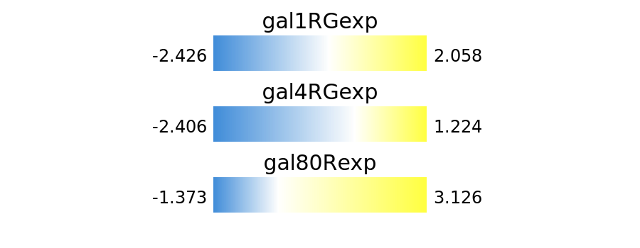

#### [Home](index.md) | [User Guide](userguide.md) |
[Tutorial](tutorial.md) | [Config file reference](configfile.md) |
**Demo** | [Gallery](gallery.md)

# A demo visualization by Tabnetviz

The following visualization has been produced from the "galFiltered"
data set from Ideker et al., Science 292:929 (2001); the data files
are also included as sample data with Cytoscape.

The [node table](galExpData.csv) and the [edge table](galFiltered.csv)
are available as CSV files. The Tabnetviz configuration file is
available [here](galFiltered.yaml).

Nodes correspond to yeast genes and edges represent various
interactions. The node size is associated with node degree and font
size is also adjusted to vary with node size. We used the `wedged`
node style to divide the circles into 3 parts; each part is colored
using a colormap by the gene expression level in 3 conditions
corresponding to 3 columns in the node table. Edges are colored by
interaction type, and can be directed or undirected.

The resulting visualization is an [SVG file](galFiltered.svg) and is
included below:

As we requested the color bars representing the color scales to be
output into an SVG file as well, a [colorbars
file](galFiltered_colorbars.svg) has also been written. It is also
included here:

