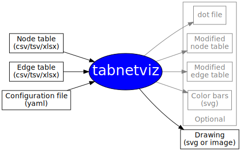

#### [Home](index.md) | [User Guide](userguide.md) | [Tutorial](tutorial.md) | [Config file reference](configfile.md) | [Demo](demo.md) | **Gallery**

# Gallery of visualizations created with Tabnetviz

Click on the images to view them in large size. We provide the node
table, edge table, and tabnetviz configuration file for each
visualization. See a further example in the [demo](demo.md).

## Transcription factor network

* [Node table](top20nodetable.csv)
* [Edge table](top20edgetable.csv)
* [Config file](top20t2n.yaml)

This is Figure 9 in [our
paper](https://www.mdpi.com/1422-0067/21/2/628), see the paper for an explanation.

## Gene co-expression network

* [Node table](TBDE-PE-detr.csv)
* [Edge table](corr220c8.csv)
* [Config file](corr220mod.yaml)

This is Figure 10a in [our
paper](https://www.mdpi.com/1422-0067/21/2/628), see the paper for an explanation.

* [Node table](TBDE-PE-detr.csv)
* [Edge table](corr220c8.csv)
* [Config file](corr220fc.yaml)

This is Figure 10b in [our
paper](https://www.mdpi.com/1422-0067/21/2/628), see the paper for an explanation.

## Flowchart

* [Node table](tnv-nodes.csv)
* [Edge table](tnv-edges.csv)
* [Config file](tnv.yaml)

Tabnetviz can also be used to create flowcharts. Typically, the `dot`
layout engine is used for that purpose. This flowchart illustrates the
function of Tabnetviz.
