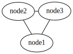
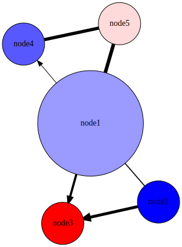
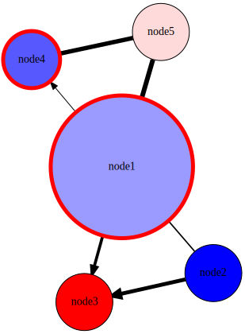
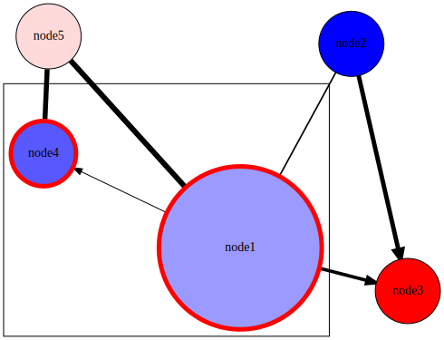

#### [Home](index.md) | [User Guide](userguide.md) | **Tutorial** | [Config file reference](configfile.md) | [Demo](demo.md) | [Gallery](gallery.md)

# Tabnetviz tutorial

To use **Tabnetviz**, you need 3 files: a **node table**, an **edge
table**, and a **configuration file**. In this tutorial, we show how
to construct these files in order to create a visualization.

## The simplest configuration file

As a bare minimum, Tabnetviz needs only an edge table, and will infer
the node table from the edges. If we have a simple network with 3
edges, the edge table may look like this as a tab-separated values
file (`edgetable_simplest.tsv`):

~~~tsv
source	target
node1	node2
node2	node3
node3	node1
~~~

This 3-node network can be visualized by Tabnetviz using the following
configuration file (let's name it `simplest.yaml`):

`simplest.yaml`:
~~~yaml
edgetable: edgetable_simplest.tsv
~~~

After issuing the command `tabnetviz simplest.yaml` (or `tabnetviz.py
simplest.yaml` depending on how Tabnetviz is installed), the resulting
`out.svg` file will look like this:

## Adding node and edge properties

Let's add a few more nodes and edges, and some properties to the nodes
and edges:

Node table (`nodetable_simple.tsv`):
~~~tsv
name	score	fruit
node1	-0.5	apple
node2	-1.2	orange
node3	1.12	orange
node4	-0.8	apple
node5	0.13	orange
~~~

Edge table (`edgetable_simple.tsv`):
~~~tsv
source	target	weight	directed
node1	node2	1.11	false
node1	node3	2.22	true
node1	node4	0.73	true
node1	node5	3.44	false
node2	node3	2.85	true
node4	node5	3.16	false
~~~

Let's visualize the network with nodes as circles, with the size of
the circle depending on the degree of the node. Let's use a color
scale for the fill color of the node based on the _score_ column.
Let's draw the edges with a line width depending on edge weight (the
_weight_ column in the edge table), and let's draw edges with
_directed_=true with arrows.

To do this, we add the `networkanalysis: Degree` line to the
configuration file to calculate node degrees. To define the appearance
of nodes, we use the `nodestyles` keyword, and define the `default`
styles. We set the node shape to `circle`, the style to `filled`, and
use a linear mapping to map _Degree_ to node height. We also use a
`colormap` mapping to map _score_ to node color using a blue-white-red
color scale (`bwr`). We define edge styles using the `edgestyles`
keyword, and set a `default` style, using a linear mapping of the edge
_weight_ to `penwidth`, and mapping the _directed_ column by
`discrete` mapping to the `dir` edge attribute to obtain arrowheads
for the directed edges. We also set the names of the output files.
This results in the following configuration file:

`simple.yaml`:
~~~yaml
nodetable: nodetable_simple.tsv
edgetable: edgetable_simple.tsv
outputfiles: output_simple.svg
networkanalysis: Degree
nodestyles:
  default:
    shape: circle
    style: filled
    height:
      type: linear
      colexpr: Degree
      mapmin: 1.0
      mapmax: 2.5
    fillcolor:
      type: colormap
      colexpr: score
      colormap: bwr
edgestyles:
  default:
    penwidth:
      type: linear
      colexpr: weight
      mapmin: 1.0
      mapmax: 6.0
    dir:
      type: discrete
      colexpr: directed
      map:
        true: forward
        false: none
~~~

The resulting `output_simple.svg` looks like this:

## Using node groups

A powerful feature of Tabnetviz is the ability to define node and edge
groups using Boolean expressions, and apply node/edge styles to them.

Let's define a node group containing nodes for which _score_ is
negative and _fruit_ is "apple". Let's display these with a red,
thicker outline. The following lines are added to the configuration
file above:

~~~yaml
nodegroups:
  group1: score < 0 and fruit == 'apple'
~~~

and the following is added to the `/nodestyles` section:

~~~yaml
  group1:
    color: red
    penwidth: 5.0
~~~

We also modify the names of the output files. The resulting
`output_simple2.svg`, generated from [simple2.yaml](simple2.yaml)
looks like this:

If we rewrite the `outputfiles` section as

~~~yaml
outputfiles:
  drawing: output_simple2.svg
  colorbars: simple2_colorbar.svg
~~~

to the `outputfiles` section then we get a new file named
`simple2_colorbars.svg`, containing a nice colorbar showing the color
scale we have used. This can be used to create a legend for our
visualization (you can further edit it in Inkscape, for example):

If we use the **fdp** layout engine (`layout: fdp`) and define node
group _group1_ as a cluster (`clusters: [group1]`), we also get a box
drawn around this group (`output_simple3.svg` generated from
[`simple3.yaml`](simple3.yaml)):

## Learn more

These simple examples illustrate the basic usage of Tabnetviz. Further
information can be found in the [User Guide](userguide.md) and the
[Configuration File Reference](configfile.md). You can also use the
`--configtemplate` option to write a configuration template and use it
as a start to develop your own configuration file.
