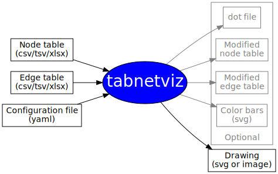

# Tabnetviz User Guide

**Tabnetviz** is a command-line tool for generating network
visualizations from tabular data. The data are provided to the program
as a node table and an edge table defining the network; both tables
can contain an arbitrary number of node properties and edge
properties. These tables can be provided as comma-separated (CSV) or
tab-separated (TSV) text files or as Excel worksheets. Tabnetviz
generates the network visualization by mapping the node and edge
properties to visual attributes such as node sizes, shapes, colors,
edge colors, width, etc. This mapping is defined in a simple
configuration file, which is written manually and uses the
human-readable YAML format. The output from Tabnetviz is a drawing as
an SVG file or an image file.

The function of Tabnetviz is illustrated with the following
flowchart (itself created with **tabnetviz**):

## INSTALLATION

**Tabnetviz** uses Python 3.2+. Once you have Python installed, you
can install Tabnetviz by

`pip install tabnetviz`

(or `pip3` if you have separate pips for Python 2 and 3).

Alternatively, you can download the source distribution from
[github](https://github.com/aszilagyi/tabnetviz).

(Note that sometimes `pip` cannot install `pygraphviz` (required for
**tabnetviz**) correctly because of a compilation error. In this case,
you may try to install it in another way. On Debian Linux, use `apt
install python3-pygraphviz`, or `apt install libgraphviz-dev` before
using `pip`. See [this
discussion](https://github.com/pygraphviz/pygraphviz/issues/155) for
more details.)

## COMMAND LINE

`tabnetviz [-h] [-w] [--configtemplate]` _`configfile`_

* `-h`: print a help message
* `-w`: "watch" mode: the program will not exit after generating the
output; instead, it will watch the configuration file for changes, and
regenerate the output whenever a change is detected. This is useful
for developing and refining the configuration file. If the output is
an image, using this option along with an image viewer that also
reloads the image upon a file change allows one to develop the
configuration file semi-interactively. `qiv` for Linux is an example
of a suitable image viewer (use it with the `-T` option).
* `--configtemplate`: write a configuration file template to the
specified file (the file must not exist). This can be edited to
develop a configuration file for your visualization.

## CONFIGURATION FILE

Below, we describe how the configuration file specifies the network
and the mappings between node/edge properties and visual attributes.
Please refer to the [Configuration File Reference](configfile.md) for
detailed descriptions of configuration file options.

The configuration file uses the
[YAML](https://github.com/Animosity/CraftIRC/wiki/Complete-idiot%27s-introduction-to-yaml)
format, which is essentially a hierarchical structure of keywords and
values. To make it easier to refer to an element in the hierarchy, we
will use a path-like notation, e.g. if the YAML contains

~~~yaml
keyword1:
  keyword2: value
~~~

then the first keyword will be referred to as `/keyword1`, and the
second keyword as `/keyword1/keyword2`, or just `keyword2` when the
context makes it clear that it is under `/keyword1`.

A configuration file template can be written from the program using
the `--configtemplate` option. An easy way to develop a configuration
file for your visualization is to start with this template and edit it
by uncommenting and editing lines as you wish.

Note that the YAML parser performs a number of type conversions. In
particular, the words yes, Yes, YES, no, No, NO, true, True, TRUE,
false, False, FALSE, on, On, ON, off, Off, OFF will all be parsed as
Boolean. On the other hand, the node and edge table files (CSV, TSV,
or Excel) will be parsed with the Pandas module of Python. This will
parse the words true, True, TRUE, false, False, FALSE as Boolean, but
the other words listed above will be parsed as strings.

In addition, the `#` character indicate comments in YAML, thus values
containing it must be enclosed in (single or double) quotes. For
example, write `color: '#ff00ff'` and not `color: #ff00ff`.

### DEFINING THE NETWORK

The type of the network (`directed` or `undirected`) is specified with
the `/networktype` keyword. The default is `undirected`. If you have a
network with both directed and undirected edges, define it either
`directed` or `undirected`, and then use the `dir` edge attribute to
set the edge type based on an edge table column. This is typically
done under the `/edgestyles` keyword using a `discrete` mapping type
(see later). The `networktype` setting will affect the calculations if
a network analysis is requested (see later).

A title can be given to the network using the `/title` keyword; for SVG
output, this will appear as a mouse pointer tooltip when hovering over
the background. To display text below the graph, use the `label`
attribute under the `/graphattrs` keyword. 

A node table and an edge table should be prepared as CSV or TSV files
or Excel worksheets (xls or xlsx files). These are specified under the
`/nodetable` and `/edgetable` keywords, respectively. You can either
provide the filename directly (such as `edgetable: edges.csv`), or
provide other parameters as well under the `/nodetable` or `/edgetable`
keyword. In the latter case, the `file` keyword specifies the file
name, `filetype` the file type (optional). For Excel files, the sheet
name can be specified using the `sheetname` keyword. For the edge
table, the columns containing the source and target identifiers should
be specified as `sourcecolumn` and `targetcolumn` (`source` and
`target` by default). For the node table, the column containing the
node identifier should be specified using the `idcolumn` keyword
(`name` by default). For the node table, the `skipisolated` keyword
can be used to omit isolated nodes from the network entirely. In edge
tables exported from Cytoscape, the source and target identifiers are
not in separate columns; set the `fromcytoscape` keyword to `true` to
make the program handle it correctly.

### COLUMN NAME CONVERSION

As **Tabnetviz** uses the column names as variable names in
expressions for node/edge group definitions and visual style
definitions, all column names will be automatically converted to valid
variable names. This is done by omitting all characters other than
letters, digits, and the "_" character. If a variable name would thus
start with a digit, a `c` character will be prepended. Examples of
conversions:

|Column name |Variable name|
|------------|-------------|
|First Name  |FirstName    |
|Weight (kg) |Weightkg     |
|area (m2)   |aream2       |
|220V_rating |c220V_rating |
|Fraction (%)|Fraction     |

### OUTPUT FILES

Output files are specified with the `/outputfiles` keyword.
**Tabnetviz** always generates a drawing file (an SVG or an image
file) containing the actual visualization; this is specified with the
`/outputfiles/drawing` keyword (if omitted then the output will go to
`out.svg`). If only a drawing is to be generated, the `drawing`
keyword can be omitted and the short form can be used, such as
`outputfiles: network.svg`. Other files can optionally be generated
with the following keywords under `/outputfiles`:

* **dot**: A **.dot** file containing the layout. The dot file can be
loaded in a later run to produce another drawing with the same layout.
* **nodetableout**, **edgetableout**: the modified node table and edge
table file after adding new columns from network analysis, added
rankings, Boolean columns defining node/edge groups, and added
non-Graphviz properties. Note that the exported files will contain the
converted column names. The tables can be exported as csv, tsv, or
Excel files, decided by the extension of the file name.
* **colorbars**: An SVG file containing color bars for the colormaps
used in the node style and edge style mappings. These can then be used
to create a legend for your visualization.

### GRAPH LAYOUT

The `/layout` keyword can be used to set the graph layout algorithm.
Any algorithm known to Graphviz can be used, i.e. `neato`, `dot`,
`twopi`, `circle`, `fdp`, `sfdp`, and `patchwork`. The default is
`neato`. Alternatively, a **.dot** file name can be specified; this
must contain position information, and the layout will be directly
loaded from it. This file usually comes from an earlier run of the
program.

### GRAPH ATTRIBUTES

The `/graphattrs` keyword can be used to set attributes for the whole
graph. Any graph attributes known to Graphviz can be used; see the
[Graphviz website](https://www.graphviz.org/doc/info/attrs.html) for a
list of available visual attributes. **Tabnetviz** will set
`outputorder: edgesfirst` and `overlap: false` by default for a nicer
visual appearance of the graph.

### NETWORK ANALYSIS

The `/networkanalysis` keyword can be used to Indicate whether a
network analysis should be performed (`false` by default). Graph
theoretical quantity names can be provided, either a single quantity,
a list of quantities, or the keyword `all` to calculate all
quantities. The calculated quantities will be added as new columns to
the node table and the edge table, and can then be used to specify
node styles and edge styles. The following quantities can be
calculated for each node for both directed and undirected networks:
**AverageShortestPathLength, BetweennessCentrality,
ClosenessCentrality, ClusteringCoefficient, Degree, Connectivity,
Eccentricity, NeighborhoodConnectivity, SelfLoops, Stress**. For
edges, **EdgeBetweenness** can be calculated. For directed networks
only, **Indegree** and **Outdegree** can be calculated. For undirected
networks only, **Radiality** and **TopologicalCoefficient** can be
calculated. These quantity names match those calculated by the Network
Analyzer plugin of Cytoscape, except for **Connectivity** (not
calculated by Cytoscape), which is the number of neighbors of a node,
as opposed to **Degree** which is the number of edges connecting to a
node. Also, Tabnetviz uses the same quantity definitions as the
Network Analyzer plugin of Cytoscape and yields numerically the same
results, except for ClusteringCoefficient in the case of directed
graphs, where Tabnetviz uses the Networkx Python module function which
uses a slightly different definition.

It is recommended that you explicity list the quantities you want to
be calculated rather than specifying `all` because calculating all
quantities may take a long time for large networks.

### DEFINING NODE GROUPS AND EDGE GROUPS

Node groups and edge groups can be defined by providing Boolean
expressions of node table or edge table columns, or by explicitly
listing the nodes/edges you want in the group. Visual styles can later
be applied on these groups. Under the `/nodegroups` and `/edgegroups`
keyword, provide _`groupname: columnexpression`_ key-value pairs, with
_`groupname`_ being the group name of your choice, and
_`columnexpression`_ being an expression using node table or edge
table column names. The group name must not match an existing column
name except if it is a Boolean column. The expression can contain
simple numerical or string operations. The program uses the `query`
method of a Pandas dataframe internally. Python string methods can be
used by appending `.str` to the column name. Examples for expressions:

~~~
a+b < 5
c == 'YES'
x < 5 and y > 2
d.str.upper() < 'M'
~~~

You can also define node/edge groups by providing an explicit
node/edge list instead of a Boolean expression, although this is not
recommended; if you want an explicit group, it's better to add a
Boolean table column defining the group than to list it in the
tabnetviz configuration file. A node list is a comma-separated list of
node names (space after the comma is necessary!) in square brackets:
`[node1, node23, node57]`. An edge list is specified by providing a
list of **(source, target)** pairs, e.g `[(node1, node3), (node5,
node7), (node8, node13)]`.

Groups are added to the node/edge table as new Boolean columns. As
group definitions are processed in the order they appear in the
configuration file, definitions can refer to groups defined earlier.
For example, if you defined a group `group1`, you can define its
complement as `not group1`.

### DEFINING CLUSTERS

Clusters are node groups with a box drawn around them. Currently, only
the `dot` and `fdp` layout algorithms support drawing clusters.
Clusters can be nested (in that case, the corresponding node groups
must be subsets of each other); overlapping clusters are not allowed.
There are a number of visual attributes defining how to draw clusters;
see the attributes indicated by the letter C in the [Graphviz
documentation](https://www.graphviz.org/doc/info/attrs.html). Commonly
used cluster attributes include `color`, `fillcolor`, `label`,
`labelloc`, `fontname`, `fontsize`, `fontcolor`, `style` (= `solid`,
`dashed`, `dotted`, `rounded`, `filled`, etc.)

Clusters are specified in **Tabnetviz** using the `/clusters` keyword.
This must be followed by a list of the node groups corresponding to
each cluster. If you don't want to specify visual attributes for the
clusters, you can provide a simple list such as:

~~~yaml
clusters: [nodegroup1, nodegroup2, nodegroup4]
~~~

If you want to specify visual attributes, you can provide the cluster
definitions in a dictionary, providing the attributes as key-value
pairs, e.g:

~~~yaml
clusters:
  nodegroup1:
    label: First cluster
    fontsize: 10
  nodegroup2:
    style: filled
    fillcolor: grey
  nodegroup4:
~~~

Here, we did not provide attributes for `nodegroup4`, but note that
the `:` is still needed. Alternatively, a list can also be used, using
the "dash" notation:

~~~yaml
clusters:
  - nodegroup1:
      label: First cluster
      fontsize: 10
  - nodegroup2:
      style: filled
      fillcolor: grey
  - nodegroup4
~~~

See the [Configuration File Reference](configfile.md) for the full
specification.

### ADDING RANKINGS

Optionally, new node/edge table columns containing rankings of
existing node/edge table columns can be added. This is done via the
`/addrankings` keyword. See the [Configuration File
Reference](configfile.md) for details.

### DEFINING COLOR MAPS

Color maps are used to map numerical values to colors, either discrete
colors or a smooth color transition. **Tabnetviz** can use the
[standard color maps defined in
Matplotlib](https://matplotlib.org/3.1.1/gallery/color/colormap_reference.html),
but custom color maps can also be defined via the `/colormaps`
keyword. For example, a smoothly varying color map from blue through
white to yellow (we name it "bwy") can be defined as this:

~~~yaml
colormaps:
  bwy:
    type: continuous
    map:
      0.0: '#0066CCC0'
      0.5: '#FFFFFFC0'
      1.0: '#FFFF00C0'
~~~

A discrete color map is specified by listing the colors you want:

~~~yaml
colormaps:
  mycolors:
    type: discrete
    map:
      - green
      - yellow
      - orange
      - '#fabcee'
~~~

In a continuous color map, the colors will smoothly transition into
each other, while there will be no transition in a discrete color map.
Typically, you would use a continuous color map to map floating point
values and a discrete color map to map integer values.

Colors can be specified by color names, RGB, RGBA or HSV formats; see
the [Graphviz
documentation](https://www.graphviz.org/doc/info/attrs.html#k:color)
for a description of available formats. See the [Configuration File
Reference](configfile.md) for the full description of how to define
custom color maps. The color maps can then be used for the mappings of
node/edge properties to visual attributes.

When using color maps in your visualization, you will probably want to
add a legend to your figure displaying a color bar with the minimum
and maximum values shown. The `/outputfiles/colorbars` keyword can be
used for this: provide an SVG file name, and Tabnetviz will write a
separate svg file with this name, containing colorbars for the
colormaps used in your mappings.

### MAPPING NODE AND EDGE PROPERTIES TO VISUAL ATTRIBUTES

Any node/edge table column or an expression using columns can be used
to define a mapping to visual attributes. The `/nodestyles` keyword is
used to define node attribute mappings, and the `/edgestyles` keyword
to define edge attribute mappings. A mapping can be applied to all
nodes or edges (using the `/nodestyles/default` and
`/edgestyles/default` keywords, respectively), or a node group or edge
group that has previously been defined via the `/nodegroups` or
`/edgegroups` keyword. **Tabnetviz** applies the mappings in the order
they appear in the configuration file. Thus, if you define two
overlapping node groups and specify a mapping for each one, the second
mapping will overwrite the first mapping for the nodes in the
intersection of the two node groups. However, the `default` mapping
will always be applied first, and will be overwritten by any group
mappings.

The general structure of node style mappings is like this:

~~~yaml
nodestyles:
  default:
    attributename1:
      ...
    attributename2:
      ...
    ...
  nodegroup1:
    attributenameN:
      ...
    attributenameM:
      ...
    ...
  nodegroup2:
    ...
~~~

Thus, one first defines the styles for all nodes (`default` group) and
then styles for any node group defined earlier (_nodegroup1_,
_nodegroup2_, etc.). For each group, the attributes to map are named,
and the mapping is defined as described below. The edge styles are
defined similarly.

#### VISUAL AND CUSTOM ATTRIBUTES

Any node/edge attribute known to Graphviz can be used; please refer to
the [Graphviz website](https://www.graphviz.org/doc/info/attrs.html)
for a detailed description of the available attributes. Here, we
summarize the most commonly used attributes.

##### The most commonly used visual node attributes

|Attribute description|Attribute name|Attribute values, remark        |
|---------------------|--------------|--------------------------------|
|Border color         |`color`       |color specification             |
|Border line width    |`penwidth`    |width in points                 |
|Border line type     |`style`       |`solid,dashed,dotted,bold`      |
|Fill color           |`fillcolor`   |color; `style` must be `filled` |
|Label                |`label`       |string (default is node name)   |
|Tooltip              |`tooltip`     |string                          |
|Shape                |`shape`       |`box,circle,ellipse`... (many shapes available)|
|Node style           |`style`       |`solid,filled,striped,wedged`...|
|Label font name      |`fontname`    |a font name                     |
|Label font size      |`fontsize`    |in points                       |
|Label font color     |`fontcolor`   |color specification             |
|Node image           |`image`       |path to image file              |
|Node height          |`height`      |in inches (1 inch = 72 points)  |
|Node width           |`width`       |in inches                       |

##### The most commonly used visual edge attributes

|Attribute description      |Attribute name |Attribute values, remark  |
|---------------------------|---------------|--------------------------|
|Line color                 |`color`        |color specification       |
|Line type                  |`style`        |`solid,dashed,dotted,bold`|
|Line width                 |`penwidth`     |in points                 |
|Directedness               |`dir`          |`forward,none,both`       |
|Arrow shape                |`arrowhead`    |`normal,empty,tee,vee`... (many shapes available)|
|Label                      |`label`        |string                    |
|Label font name            |`fontname`     |font name                 |
|Label font size            |`fontsize`     |in points                 |
|Label font color           |`fontcolor`    |color specification       |
|Head label                 |`headlabel`    |string                    |
|Tail label                 |`taillabel`    |string                    |
|Head/tail label font name  |`labelfontname`|font name                 |
|Head/tail label font size  |`labelfontsize`|in points                 |
|Head/tail label font color |`labelfontcolor`|color specification      |

Custom non-Graphviz attributes can also be used; the names of these
must start with the `ng` prefix to indicate to **Tabnetviz** that it
is a non-Graphviz attribute. Thus, Tabnetviz will throw an error
message if the user tries to define a non-Graphviz attribute not
starting with `ng`. Non-Graphviz attributes will be added as new
columns to the node table or edge table, and can then be used to
define mappings to Graphviz attributes. See the `combine` mapping type
for examples of how to use this feature.

#### MAPPING TYPES

**Tabnetviz** knows the following mapping types:

* Constant value: this is in fact not a mapping; every node/edge in
the given group will get the same constant value. See an example later
in this document.

The actual mappings map node/edge table column data to visual
node/edge attributes. These mapping types are:

* `direct`: Attribute value is directly taken from the table. The
value can be used as it is, or transformed through a specified
expression (this allows you to specify an arbitrary mapping).
* `discrete`: Discrete values in the table will be mapped to the
specified attribute values.
* `linear`: A linear transformation of table values to the specified
range.
* `cont2disc`: Continuous-to-discrete mapping. Ranges of a continuous
parameter taken from the table are mapped to the specified discrete
attribute values.
* `colormap`: Table values (floating point or integer) are mapped to colors, 
either discrete or continuous.
* `combine`: Combine multiple non-Graphviz attributes into a
multi-valued attribute such as position or color list. The result is
formatted using a specified format string.

The mapping type is specified using the `type` keyword under the given
attribute name, i.e. for node styles:
`/nodestyles/`_groupname_`/`_attributename_`/type`.

#### COLUMN EXPRESSIONS

The `direct`, `discrete`, `linear`, `cont2disc`, and `colormap`
mapping types use a `colexpr` parameter. This defines which table
values should be used for the mapping. It can either be a single table
column name, or an expression on table column names, which can be a
simple numerical expression or a string expression. Examples for
column expressions:

~~~
a
abs(a)+b/c
a.str.upper()+b
~~~

Internally, this uses the Pandas `eval` dataframe method with the
Python engine.

This also means that you could define a linear mapping by yourself
using an expression, and use the `direct` mapping type instead of the
`linear` mapping type. However, the `linear` mapping type is easier to
use as it is enough to specify the minimum and maximum values of the
range to map to.

#### EXAMPLES OF MAPPINGS

We provide examples for each mapping type below. Please see the
[Configuration File Reference](configfile.md) document for a full
description of the available parameters for each mapping type. We will
use the `default` group for each mapping, but these could work with
any node/edge group as well. Also, we only show node style mappings;
edge style mappings work the same way.

##### Constant value

This is not a mapping as we do not use data from the node table, just
set a constant value. To set the fill color of all nodes to green:

~~~yaml
nodestyles:
  default:
    fillcolor: green
~~~

##### `direct` mapping

Set node height from sum of columns A and B:

~~~yaml
nodestyles:
  default:
    height:
      type: direct
      colexpr: A+B
~~~

##### `discrete` mapping

Set node fillcolor to green, red, or yellow based on the value of the
"Fruit" column in the node table:

~~~yaml
nodestyles:
  default:
    fillcolor:
      type: discrete
      colexpr: Fruit
      map:
        avocado: green
        tomato: red
        lemon: yellow
~~~

##### `linear` mapping

Set node height from percentage, mapping the 0-100 range to 4-8

~~~yaml
nodestyles:
  default:
    height:
      type: linear
      colexpr: Percentage
      colmin: 0
      colmax: 100
      mapmin: 4
      mapmax: 8
~~~

##### `cont2disc` mapping

Set node shape to circle, triangle, or box depending on "Age" value:

~~~yaml
nodestyles:
  default:
    shape:
      type: cont2disc
      colexpr: Age
      map:
        12.0: circle
        20.0: triangle
        higher: box
~~~

##### `colormap` mapping

Set node fillcolor on a continuous red-white-blue color scale based on
a column named "Percentage". This a reversed "bwr" scale from
Matplotlib (we could also use `bwr_r`).

~~~yaml
nodestyles:
  default:
    fillcolor:
      type: colormap
      colexpr: Percentage
      colmin: 0.0
      colmax: 100.0
      colormap: bwr
      reverse: yes
~~~

##### `combine` mapping

Set node coordinates from "x" and "y" columns in the table. We 
combine them to the `pos` attribute by joining them with a comma:

~~~yaml
nodestyles:
  default:
    pos:
      type: combine
      attrlist: [x, y]
      formatstring: '%f,%f!'
~~~

The exclamation mark at the end of the format string is to force the
layout algorithm to keep the position fixed.

Often, the attributes to combine are not in the table but need to be
created first by using a mapping. In this case, non-Graphviz
attributes starting with `ng` should be used, e.g. if you want to
multiply table values with 10 before combining:

~~~yaml
nodestyles:
  default:
    ngx:
      type: direct
      colexpr: 10*x
    ngy:
      type: direct
      colexpr: 10*x
    pos:
      type: combine
      attrlist: [ngx, ngy]
      formatstring: '%f,%f!'
~~~

The `combine` mapping can also be used to define color lists. For
example, we can use the `wedged` node style to draw nodes divided into
two parts with different fill colors. The two colors may be mapped
from two node table columns `value1` and `value2`. We define two
non-Graphviz colors (`ngcolor1`, `ngcolor2`) and combine them into a
colorList with two elements (separated with a colon):

~~~yaml
nodestyles:
  default:
    shape: circle
    style: wedged
    ngcolor1:
      type: colormap
      colexpr: value1
      colormap: bwr
    ngcolor2:
      type: colormap
      colexpr: value2
      colormap: bwr
    fillcolor:
      type: combine
      attrlist: [ngcolor1, ngcolor2]
      formatstring: '%s:%s'
~~~

A more complex example can be found in the [demo
file](galFiltered.yaml).
